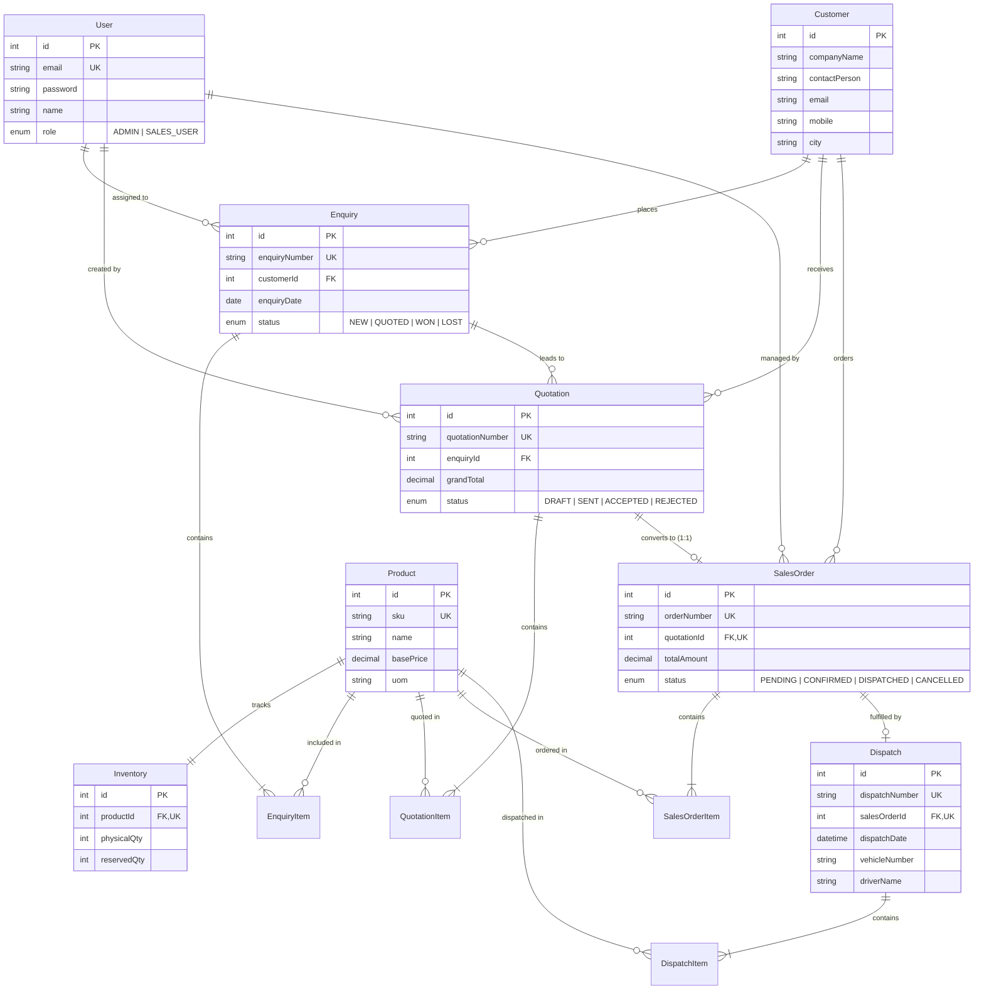

# Mini ERP - Manufacturing & Sales Management System

A production-ready PERN-stack Mini ERP designed for industrial sales, quotation management, and inventory-backed order fulfillment. Built with strict backend authorization (RBAC), atomic database-level transactions, PostgreSQL row-level locking (`FOR UPDATE`) to prevent overselling, and automated stock reservation and dispatch flows.

---

## 🚀 Workflow Overview

```
 [ AUTH / LOGIN ]
   ├── ADMIN (Full access, confirm orders, process dispatch, view all)
   └── SALES_USER (Customers, enquiries, quotations, conversions)
          │
          ▼
 [ CUSTOMER & ENQUIRY ]
   └── Multi-product enquiries with status lifecycle: NEW → QUOTED → WON / LOST
          │
          ▼
 [ QUOTATION & FINANCIAL CALCULATION ]
   └── Item-level calculations computed strictly on backend:
       - base_amount = quantity * unit_price
       - discount_amount = base_amount * discount_pct / 100
       - after_discount = base_amount - discount_amount
       - gst_amount = after_discount * gst_pct / 100
       - line_amount = after_discount + gst_amount
       - grand_total = SUM(line_amount)
   └── Lifecycle: DRAFT → SENT → ACCEPTED / REJECTED
          │
          ▼
 [ CONVERSION TO SALES ORDER ]
   └── Transactional conversion of ACCEPTED quotations to Sales Orders
   └── 1:1 Uniqueness constraint (prevents duplicate sales orders per quotation)
          │
          ▼
 [ ADMIN CONFIRMATION & INVENTORY RESERVATION ]
   └── PostgreSQL row-level locking (`SELECT ... FOR UPDATE`)
   └── Atomic reservation: increases `reserved_quantity` while `physical_quantity` remains unchanged
   └── Re-reads stock post-lock to prevent race conditions and concurrent overselling
          │
          ▼
 [ ADMIN DISPATCH & INVENTORY DEDUCTION ]
   └── Decrements both `physical_quantity` and `reserved_quantity` atomically
   └── Validates against over-dispatch and cancelled orders
   └── Transitions order status: CONFIRMED → DISPATCHED
```

---

## 🛠️ Tech Stack

- **Backend**: Node.js, Express.js
- **Database**: PostgreSQL (Supabase hosted)
- **ORM**: Prisma ORM with connection pooling (`DATABASE_URL`) and direct session connection (`DIRECT_URL`)
- **Authentication**: JWT (JSON Web Tokens) with `bcryptjs` password hashing and role-based middleware (`ADMIN`, `SALES_USER`)
- **Frontend**: React 18, Vite, Vanilla CSS design system (zero unnecessary heavyweight dependencies)
- **Testing**: Jest, Supertest, customized 18-step end-to-end integration suite

---

## 🗄️ Database Entity Relationship Diagram (ERD)



---

## 🔑 Seeded Demo Credentials

| Role | Email | Password | Permissions |
| :--- | :--- | :--- | :--- |
| **Admin** | `admin@mini.erp` | `Admin@123` | Full access: confirm orders, lock inventory, process dispatches, view all |
| **Sales User** | `sales@mini.erp` | `Sales@123` | Manage customers, enquiries, quotations, convert to Sales Orders, view inventory |

*(Passwords are securely hashed in PostgreSQL via `bcryptjs`).*

---

## ⚙️ Environment Variables

Create `backend/.env` based on `backend/.env.example`:

```env
PORT=4000
NODE_ENV=development
DATABASE_URL="postgresql://<user>:<password>@<pooler-host>:6543/<db>?sslmode=require"
DIRECT_URL="postgresql://<user>:<password>@<direct-host>:5432/<db>?sslmode=require"
JWT_SECRET="your-jwt-secret-key"
FRONTEND_URL="http://localhost:5173"
```

> **Security Note:** Never commit `.env` to Git. Ensure `.env` is listed in `.gitignore`.

---

## 📦 Installation & Setup

### 1. Clone & Install Dependencies
```bash
# Backend dependencies
cd backend
npm install

# Frontend dependencies
cd ../frontend
npm install
```

### 2. Apply Database Migrations & Seed Data
```bash
cd backend

# Deploy schema to PostgreSQL
npx prisma migrate deploy

# Seed baseline users (admin & sales), products, inventory, and sample customer
npm run seed
```

### 3. Run Development Servers
```bash
# Terminal 1 - Start Backend (Express API on port 4000)
cd backend
npm run dev

# Terminal 2 - Start Frontend (Vite on port 5173)
cd frontend
npm run dev
```

Visit `http://localhost:5173` in your browser.

---

## 🧪 Automated Testing & Verification

The suite includes **9 core rule tests** and a **full 18-step live integration workflow** running against live PostgreSQL.

### Run Jest Business Rule Tests
```bash
cd backend
npm test
```
**Covers:**
1. Quotation financial calculation (discounts, GST, grand total).
2. Unauthenticated requests rejected (401 Unauthorized).
3. RBAC security: SALES_USER cannot confirm/dispatch (403 Forbidden).
4. DRAFT quotations cannot convert to Sales Orders (400 Bad Request).
5. REJECTED quotations cannot convert to Sales Orders (400 Bad Request).
6. 1:1 Quotation-to-SalesOrder uniqueness (409 Conflict on duplicates).
7. Inventory availability enforcement: cannot confirm order exceeding available stock.
8. End-to-end confirmation, row-level locking, and stock deduction.
9. Cancelled order cannot be dispatched.

### Run 18-Step End-to-End Live Workflow
```bash
cd backend
node tests/e2e-workflow.js
```
Verifies complete flow from Sales User login, customer and multi-item enquiry creation, quotation calculation, status progression, order conversion, duplicate prevention, Admin confirmation, inventory reservation checks, dispatch, physical stock deduction, and negative-stock prevention.

---

## 📡 API Reference

### Authentication
- `POST /api/auth/login` — Authenticate user, returns JWT and user role (`ADMIN` or `SALES_USER`)
- `GET /api/auth/me` — Current authenticated user details

### Customers
- `GET /api/customers` — List all customers (Protected)
- `POST /api/customers` — Create a customer (`companyName`, `contactPerson`, `email`, `mobile`, `city`)

### Products & Inventory
- `GET /api/products` — List all products with base prices
- `GET /api/inventory` — List current stock levels (`physicalQty`, `reservedQty`, and dynamically derived `availableQty = physicalQty - reservedQty`)

### Enquiries
- `GET /api/enquiries` — List enquiries
- `GET /api/enquiries/:id` — Get enquiry with customer and multi-product items
- `POST /api/enquiries` — Create multi-product enquiry (`customerId`, `items: [{ productId, quantity }]`, `notes`)
- `PATCH /api/enquiries/:id/status` — Transition enquiry status (`NEW`, `QUOTED`, `WON`, `LOST`)

### Quotations
- `GET /api/quotations` — List quotations
- `GET /api/quotations/:id` — Get quotation with items and backend calculated line totals
- `POST /api/quotations` — Create quotation with item-level unit prices, discounts, and GST percentages
- `PATCH /api/quotations/:id/status` — Transition status (`DRAFT` → `SENT` → `ACCEPTED` / `REJECTED`)
- `POST /api/quotations/:id/convert` — Convert ACCEPTED quotation into a `PENDING` Sales Order (Strictly enforces 1:1 relationship)

### Sales Orders & Inventory Reservation
- `GET /api/sales-orders` — List sales orders with items and customer info
- `GET /api/sales-orders/:id` — Get sales order details
- `POST /api/sales-orders/:id/confirm` — **[ADMIN ONLY]** Atomically verifies and reserves inventory using row-level locking (`FOR UPDATE`). Transitions status to `CONFIRMED`.
- `PATCH /api/sales-orders/:id/cancel` — **[ADMIN ONLY]** Cancels order and releases reserved inventory.

### Dispatch & Fulfillment
- `GET /api/dispatches` — List all completed dispatches
- `POST /api/sales-orders/:id/dispatch` — **[ADMIN ONLY]** Dispatches confirmed order. Atomically decrements both `physical_quantity` and `reserved_quantity`. Transitions order to `DISPATCHED`.
